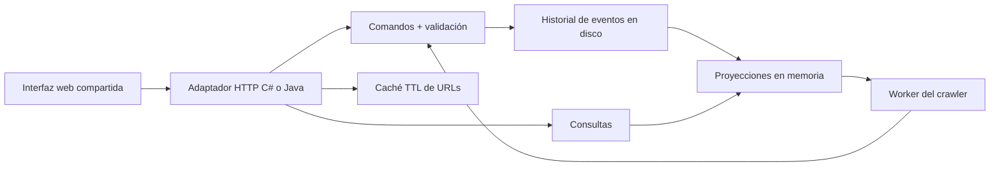

# Arquitectura y decisiones

## Implementación actual

Las versiones son alternativas autónomas. Cada proceso utiliza su propio directorio de datos. El contrato y el frontend se comparten para facilitar comparaciones; el código de dominio no se comparte entre lenguajes.

La tienda horizontal `/commerce` añade un caso con **dos APIs y PostgreSQL compartido**, separado del historial JSON. Los pedidos y el stock de `/api/commerce/*` se resuelven en transacciones de la base; los otros endpoints mantienen el diseño anterior. [Contrato, decisiones y pruebas de este caso](horizontal-commerce.md).

`Lab` concentra las invariantes del experimento; `Program.cs` y `Main.java` adaptan HTTP. Un bloqueo serializa comandos, consultas y worker, de modo que el stock, la asignación de conductor y las versiones no quedan expuestos a actualizaciones simultáneas dentro del nodo. Cada evento tiene `sequence`, `time`, `type` y `data`. Se escribe primero un historial nuevo, se fuerza el buffer a disco y se reemplaza el archivo antes de aplicar la proyección. El historial autoritativo permite reconstrucción al reiniciar. Una secuencia inválida o JSON corrupto impide arrancar.

El lock de escritor evita abrir el directorio dos veces con la misma implementación. No usar un directorio compartido entre C# y Java: no existe coordinación de escritura entre plataformas. El esquema de eventos es equivalente pero no hay migrador de versiones ni soporte de upgrades del formato.

La atomicidad del reemplazo y la durabilidad dependen del sistema de archivos. No se han probado cortes eléctricos, corrupción del disco ni filesystem de red. En Java se exige soporte de `ATOMIC_MOVE`; el sistema falla si no lo admite. No se puede garantizar recuperación frente a cualquier fallo físico solo por usar `Flush`/`force`.

## Atributos de calidad

| Atributo | Evidencia local | Límite / evolución |
| --- | --- | --- |
| Rendimiento | Caché de redirecciones, benchmark de lecturas con percentiles | Historial y estado crecen sin paginación; escrituras O(n) |
| Escalabilidad | Tienda con dos APIs y persistencia PostgreSQL compartida; worker y contratos comunes | Los experimentos de eventos siguen con un escritor; DB sin réplicas |
| Fiabilidad | Replay, jobs recuperables, idempotencia; backups antes del despliegue y rollback de imágenes | Sin failover del primario ni quorum; recuperación de datos manual |
| Mantenibilidad | Adaptadores separados del motor, suite compartida, documentación | Separar módulos por contexto al aumentar reglas |

## Diseños a gran escala

Los componentes de esta sección son **propuestas de evolución**, no servicios desplegados.

| Concepto del curso | Aplicación en estos sistemas | Decisión / riesgo |
| --- | --- | --- |
| DNS y balanceador | Distribuir APIs stateless por round robin o menor carga | Comprobar salud; conservar conexiones largas de chat |
| API Gateway | Entrada única con OIDC, cuotas y trazabilidad | Separar autenticación de autorización de cada servicio |
| Broker | Chat, generación de feeds y jobs de crawler | Entrega al menos una vez; inbox idempotente + outbox transaccional |
| Caché | Links y feeds con Redis | TTL e invalidación; definir tolerancia a lectura obsoleta |
| CDN | Assets de frontend y descarga de blobs versionados | URLs firmadas; no cachear datos privados sin política explícita |
| Datacenters | Réplicas regionales, rutas cercanas y recuperación | Definir RPO/RTO y cómo actuar ante particiones de red |
| Relacional | Pedidos, stock, asignaciones y versiones | Transacciones e índices; importes en unidades enteras |
| NoSQL | Mensajes por sala y posts por usuario / tiempo | Elegir particiones evitando salas o autores calientes |
| Índices / desnormalización | Código de URL, key de pedido, room+sequence, user+time | El coste de escritura aumenta; verificar con planes y métricas |
| Replicación | Réplicas de consulta del historial y feeds | Lag medible; lectura tras escritura desde el primario |
| Sharding | Hash del código, roomId, userId o fileId | Rebalanceo y operaciones entre shards explícitos |
| CAP | Pedidos/asignaciones priorizan invariantes; feed tolera retraso | Durante partición, rechazar escrituras sin dueño/quorum; no existe CAP «sin coste» |
| Multilayer / multitier | UI, servicio y almacenamiento en capas / nodos | Capas lógicas actuales no implican despliegue en tiers distintos |
| Microservicios | Contextos de catálogo, pedidos, chat y almacenamiento | Bases por servicio; evitar transacciones distribuidas implícitas |
| CQRS / Event sourcing | Comandos, historial autoritativo y proyecciones | Versionar eventos, snapshots y reconstrucción verificable |

### Decisiones específicas

**Links:** índice único para códigos, Redis cache aside, sharding por hash del código. Para expirar o editar un enlace, invalidar caché y conservar tombstone si se necesita evitar reutilización.

**Chat:** WebSocket para entrega activa, almacenamiento particionado por sala, secuencias por conversación y ack de recepción. Una sesión conectada y una entrega persistida son garantías diferentes; reconnect usa cursor para recuperar mensajes.

**E-commerce:** reserva de inventario y pedido en transacción; checkout con proveedor externo mediante saga, expiración de reserva y outbox. La búsqueda puede tolerar retrasos; el stock vendido exige una autoridad consistente.

**Red social:** fan-out por escritura para autores normales y por lectura para autores con seguidores masivos. La paginación usa cursor estable y filtros de visibilidad. La proyección puede ponerse al día tras fallos sin republicar posts.

**Taxis:** índice geoespacial por celdas y expansión a vecinos; reserva compare-and-swap con lease y expiración. Reasignaciones deben distinguir un conductor lento de uno caído y evitar dos asignaciones válidas.

**Crawler:** frontier durable por host, canonicalización, deduplicación por URL, robots.txt, límite por host, timeout y presupuesto de tamaño. Los fallos se reintentan con backoff y dead-letter queue; la expansión no debe saltarse controles de acceso a red.

**Archivos:** blobs inmutables en object storage; metadatos y versiones en base transaccional; subidas multipart, hashes y control de acceso. Publicar metadata después de confirmar el blob; recolectar blobs huérfanos con una ventana de seguridad.

## Estimaciones para un ejercicio de diseño

Ejemplo hipotético: 1 millón de usuarios diarios y 20 lecturas por usuario da 20 millones de lecturas/día, aproximadamente 232 RPS promedio. Un pico 10× exige aproximadamente 2320 RPS. Con un 10% de escrituras serían 2 millones/día. A 500 bytes por evento: aproximadamente 1 GB/día antes de índices, replicación y overhead. A 300 ms de latencia y 2320 RPS, Little's Law estima 696 peticiones en vuelo en régimen estable.

Son supuestos para practicar dimensionamiento, no resultados del benchmark ni una capacidad prometida. Para dimensionar servidores se debe medir una carga representativa con tamaño de datos y mezcla de operaciones reales.

## Fuentes técnicas

- [ASP.NET Core Minimal APIs, Microsoft](https://learn.microsoft.com/en-us/aspnet/core/fundamentals/minimal-apis?view=aspnetcore-10.0).
- [Rate limiting en ASP.NET Core, Microsoft](https://learn.microsoft.com/en-us/aspnet/core/performance/rate-limit?view=aspnetcore-10.0): siguiente ejercicio para el gateway.
- [Módulo jdk.httpserver, Java 21, Oracle](https://docs.oracle.com/en/java/javase/21/docs/api/jdk.httpserver/module-summary.html).
- [HttpServer, Java 21, Oracle](https://docs.oracle.com/en/java/javase/21/docs/api/jdk.httpserver/com/sun/net/httpserver/HttpServer.html).
