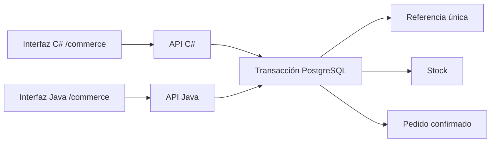

# Compras entre instancias

La tienda `/commerce` amplía el caso de compras con dos procesos reales: C# y Java aceptan el mismo contrato y consultan el mismo PostgreSQL. No mantienen stock ni referencias de compra en memoria. El cliente puede pasar de una instancia a otra y recuperar el mismo pedido con su referencia.

## Contrato

| Endpoint | Comportamiento |
| --- | --- |
| `GET /commerce` | Interfaz compartida, inventario, pedidos y enlace a la otra instancia |
| `GET /api/commerce/health` | Readiness de DB, versión/fingerprint del bootstrap, runtime, instancia y revisión |
| `GET /api/commerce/state` | Snapshot consistente de productos, pedidos y unidades vendidas |
| `POST /api/commerce/orders` | `{ "key": "pedido-001", "product": "book", "quantity": 1 }` |

Compra/reintento exitoso: HTTP 200, misma respuesta `{id,key,product,quantity,totalCents}`. Cambiar producto/cantidad de una referencia confirmada produce 409 `idempotency_conflict`. Stock insuficiente: 409 `out_of_stock`; producto ausente: 404; datos inválidos: 422; JSON inválido: 400. DB caída o recurso temporalmente no disponible: 503. Conservar la referencia permite recuperar un commit cuya respuesta no llegó al cliente.

## Transacción y permisos

La función `shop.place_order` adquiere la referencia con un índice único. Un competidor espera el commit o rollback del dueño; después recupera el pedido o adquiere la referencia liberada. Un `UPDATE` condicionado a stock suficiente bloquea la fila del producto y vuelve a evaluar el predicado cuando corresponde. La referencia, el descuento y el pedido se confirman dentro de una sola sentencia/transacción PostgreSQL. Cualquier excepción revierte sus cambios. No hay un lock de stock en C# ni Java.

Importes en centavos enteros, stock no negativo, cantidades 1–100, referencias únicas, claves foráneas y total consistente se comprueban en DB. El rol `atlas_app` tiene lectura y ejecución de funciones específicas; no puede modificar directamente el inventario. La función que escribe utiliza `SECURITY DEFINER`, tablas calificadas y un search path fijo. La base se administra con un rol separado.

Las APIs validan entradas y usan parámetros SQL. C# limita su pool a 16 conexiones; Java limita a 16 conexiones simultáneas y cierra cada conexión tras la consulta. Hay límites de conexión/consulta. Las credenciales se generan fuera del código, se montan como secretos de solo lectura y no se incluyen en los reportes. PostgreSQL no publica puertos al host.

La imagen PostgreSQL se construye desde una base fijada por digest, actualiza paquetes del sistema y utiliza `su-exec` para iniciar el servidor sin root. Se prueba y analiza junto a C# y Java; el release contiene exactamente los tres archivos de imagen verificados. El despliegue carga esas imágenes y las selecciona por su id inmutable, sin reconstruir la DB en la laptop.

## Ejecutar y conservar datos

En un clon independiente con Docker Desktop: `scripts/Start-Commerce.ps1`. El overlay `compose.commerce.yaml` añade DB y conecta las dos APIs existentes. Mantiene `atlas-csharp-data` y `atlas-java-data`; crea `atlas-commerce-data` para el almacén compartido. Conserva las claves de `.local/commerce-secrets`: una DB existente no reinicializa automáticamente sus usuarios ni su bootstrap.

Los endpoints originales `/api/orders`, `/api/state` y `/api/events` conservan el experimento de eventos de un nodo. **El almacén de `/api/commerce/*` es independiente**; no importa pedidos históricos automáticamente ni combina los dos modelos. Los otros seis casos permanecen disponibles en la interfaz original.

El bootstrap SQL es versión 1 y queda registrado con SHA-256 dentro de DB. Las actualizaciones futuras necesitan una migración revisada y una nueva versión de esquema; no se reemplaza silenciosamente una función sobre un volumen existente. La procedencia del release incluye el hash de SQL, del inicializador y la imagen PostgreSQL fijada por digest. El controlador privado compara estos valores con su configuración aprobada y comprueba el fingerprint servido por las APIs.

## Verificación obligatoria

`node tests/horizontal.mjs` utiliza imágenes previamente construidas. Crea dos APIs, una DB, puertos, red, volúmenes y claves aislados; elimina únicamente los recursos del proyecto de prueba. Red predeterminada: `10.203.76.0/24`, reservada para esta prueba en la laptop. `ATLAS_TEST_SUBNET` permite otra subred libre.

La suite comprueba 12 escenarios: instancias diferentes con el mismo esquema, interfaz, validación sin cambios, **30 reintentos concurrentes con una sola compra**, payload conflictivo, **20 compradores con 5 aceptados y 15 rechazados**, snapshots iguales, rollback de una compra rechazada, permisos SQL mínimos, continuidad con una API detenida, reinicio de ambas APIs y caída/reinicio de DB con recuperación de estado e idempotencia. Los reportes se generan en `tests/results/horizontal-*` y se conservan como evidencia de CI.

## Límites

El primario PostgreSQL es una autoridad única y un punto de fallo. Dos APIs no proporcionan failover de DB, replicación ni disponibilidad si la laptop se apaga. La prueba distribuye peticiones directamente entre procesos; no hay un balanceador instalado. Los reintentos dependen de conservar la referencia. Es una tienda de demostración, sin pagos, autenticación, multi-tenancy ni restauración automática de datos. Las consultas del ejemplo no incluyen paginación y no representan capacidad para millones de pedidos.

## Referencias

- [PostgreSQL: índices únicos y ON CONFLICT](https://www.postgresql.org/docs/current/sql-insert.html).
- [PostgreSQL: bloqueos de filas y concurrencia](https://www.postgresql.org/docs/current/explicit-locking.html).
- [Npgsql 10](https://www.npgsql.org/doc/release-notes/10.0.html), [pgJDBC](https://jdbc.postgresql.org/download/) y [su-exec](https://github.com/ncopa/su-exec).
